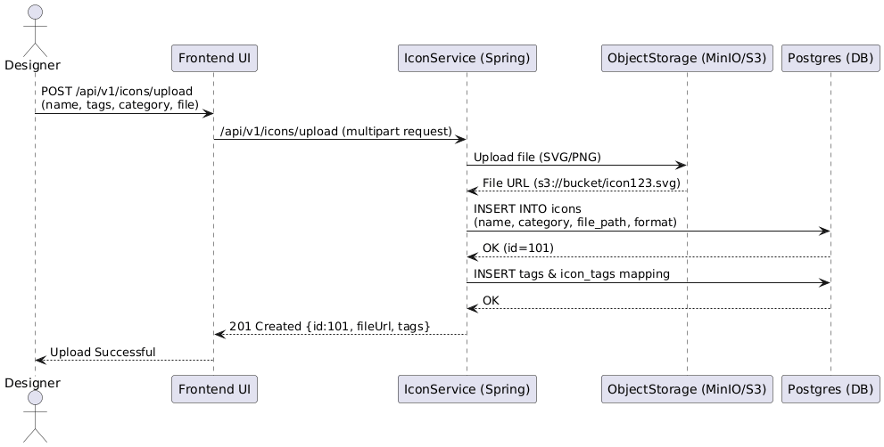
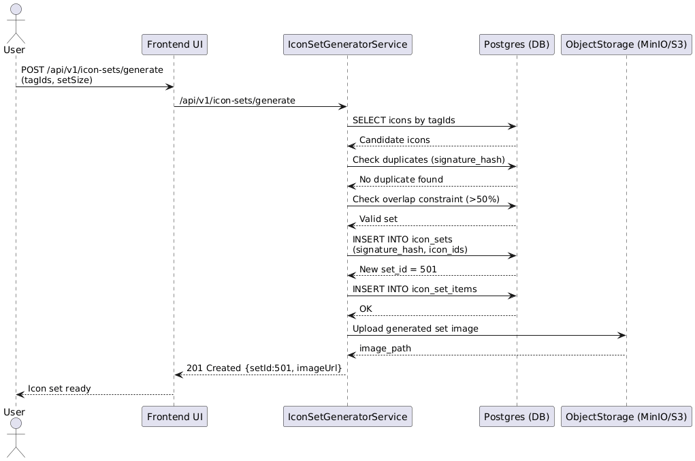

# Icon Set Generator Problem

## Design Decision Making
We need to put scalability into consideration in designing and implementation choices as our icon sets are expected to grow to be approximately 100M-Billions of data sets. We need to come up with choices to make sure it is the most efficient and optimal solution and acceptable for user experience

### Key take-aways
1. Making sure to prevent a lot of DB calls
2. Proposed logic (algorithms) are executed in DB-layer rather than application-layer for faster calculations/executions
3. Careful choices (trade-off) to have capability to handle everything in large datasets.

## Initial draft & changes in approach
In initial draft, I tried to store sorted array of generated icon_ids[] for duplicate check, and used GIN index on tags to make sure if satisfies overlap percentage. However, even though the initial proposed solution made sense for small-mid size sets, it will be bottleneck for large data sets and in the problem scope we need to make sure there will not be any issue in terms of user experience or techincal side. Therefore, there needs to be change in DB schema design and additional changes in implementation approaches. 
## Flow Diagrams
### Sequence flow
1. Case 1: Upload File Scenario 

  

2. Case 2: Generate Icon Set

  
